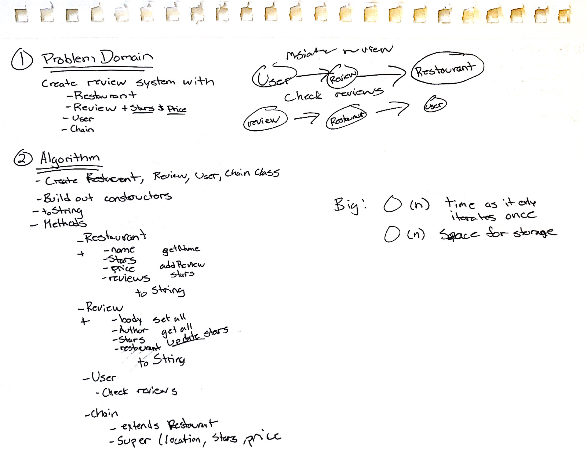
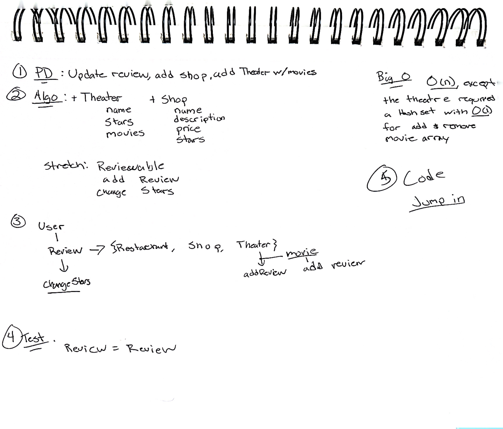

# Ckelp

Create a set of classes to represent Theaters, Shops, Restaurants, Reviews, Users, and Chain Restaurants. Implement functionality for adding reviews, updating review stars, and ensuring that a single user cannot submit multiple reviews for the same restaurant.

## Whiteboard Process

## Approach & Efficiency

O(n) where n is the number of reviews for a specific restaurant

O(1) when a movie is added or removed.

## Solution

Run `TestUtils` to check tests

### Updated for Lab 7
